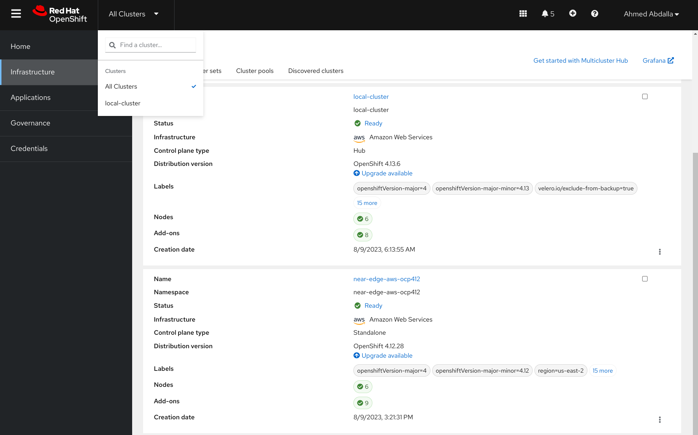

# Development Guide

> **Note**
> This guide assumes that you have already followed the steps in the [README.md](./README.md) to set-up your OpenShift Clusters, Open Data Hub, ACM, OpenShift Pipelines, etc.

## Useful Information

### Models/Apps

The GitHub repository is split into two main parts, Pipelines and ACM. Working on one part usually doesn’t involve working with the other, so you usually won’t have to set-up both dev environments.

One aspect that is similar across both are the *models*/*apps*:

* *Models* (used by Pipelines): These are the actual trained model files generated by Python ([`tf2model/`](https://www.tensorflow.org/guide/checkpoint), [`model.pkl`](https://scikit-learn.org/stable/model_persistence.html), etc.)
* *Apps* (used by ACM): Each model is packaged into its [own container image](https://github.com/opendatahub-io/ai-edge/blob/e0086c9e2c223c8d4a1df7a415d8aee736365e75/pipelines/containerfiles/Containerfile.openvino.mlserver.mlflow) alongside a model server e.g. [OVMS](https://docs.openvino.ai/2023.1/ovms_what_is_openvino_model_server.html) using the pipelines. These images are pushed to Quay and deployed as [ACM Applications](https://access.redhat.com/documentation/en-us/red_hat_advanced_cluster_management_for_kubernetes/2.8/html/applications/managing-applications)

This repo currently contains two examples:

> **Note**
>
> 1. [Example TensorFlow model from the MLflow GitHub repository](https://github.com/mlflow/mlflow/tree/ef0f922ca874dd94f9b88e8bfbde2a8cb2c385d2/examples/tensorflow)
>
> 1. [Example AzureML + MLflow + sklearn model provided by](https://github.com/stefan-bergstein/azureml-model-to-edge/tree/8e41fbfb2991cf437a6477553939e04c71103555/models/bike-rentals-auto-ml) [@stefan-bergstein](https://github.com/stefan-bergstein)
>
> These models have been selected due to the popularity of scikit-learn, TensorFlow, and AzureML. MLflow is also a popular AI/ML platform and provides [easy ways to distribute and reuse models](https://mlflow.org/docs/latest/projects.html#projects). See [#25](https://github.com/opendatahub-io/ai-edge/issues/25) and [#27](https://github.com/opendatahub-io/ai-edge/issues/27) for more information.

|                       | **1**                    | **2**                  |
|-----------------------|--------------------------|------------------------|
| **Model (Pipelines)** | `tensorflow-housing`     | `bike-rentals-auto-ml` |
| **App (ACM)**         | `tensorflow-housing-app` | `bike-rental-app`      |

### Clusters

> **Note**
> See *"Infrastructure Configuration"* in [README.md](./README.md) for more information.
>
> `near-edge-*` is just an example, you can name these clusters whatever you want.

You can visualize the clusters like this:



* `local-cluster` (default): This is the ACM hub cluster which represents a fully-fledged OpenShift cluster that's hosted on a cloud provider or at a customer data center.

* `near-edge-*`:  For an example use case, these are the near-edge clusters that can be located in a server room on-site (e.g. a factory). Typically, users in an enterprise setting have firewall restrictions for inbound traffic for such clusters and there is a high emphasis on security.

We use a mix of AWS and GCP to host these clusters for diversity. Typically you would use the `local-cluster` to test your work and this includes testing that ACM on the hub will correctly propagate the apps to the `near-edge-*` clusters.

## Pipelines

* Create a new namespace for testing (we suggest using the following naming convention for development if using shared infrastructure: `<your-username>-pipeline-dev`)
* Follow the steps in the [`Pipelines Setup README`](./pipelines/README.md).

## ACM

> **Note**
> These instructions will assume that you are making changes to the existing `bike-rental-app`.

* Create a new testing branch on your fork of the `opendatahub-io/ai-edge` repo, preferably named `<your-kerberos-name>-acm-dev`.
* Ensure that you change `namespace` in either `test/gitops/bike-rental-app/kustomization.yaml` or `test/gitops/tensorflow-housing-app/kustomization.yaml`, or both, as appropriate.
* Substitute the values of the `GIT_REPO_URL`, `GIT_BRANCH`, `CUSTOM_PREFIX`, and `CUSTOM_APP_NAMESPACE` variables in this `make` command appropriately:
NOTE: Escape the `:` in the `https://` protocol part of the `GIT_REPO_URL` value
```bash
make -s -e GIT_REPO_URL="https\://github.com/opendatahub-io/ai-edge" \
     GIT_BRANCH=my-git-branch \
     CUSTOM_PREFIX=custom-prefix- \
     CUSTOM_APP_NAMESPACE=my-test-namespace \
     test-acm-bike-rental-app-generate # or test-acm-tensorflow-housing-generate
```
* You can also do a dry-run apply of these manifests, by piping the output to `oc apply -f - --dry-run=client`, like this:

```bash
make -s -e GIT_REPO_URL="https\://github.com/opendatahub-io/ai-edge" \
     GIT_BRANCH=my-git-branch \
     CUSTOM_PREFIX=custom-prefix- \
     CUSTOM_APP_NAMESPACE=my-test-namespace \
     test-acm-bike-rental-app-generate # or test-acm-tensorflow-housing-generate | oc apply -f - --dry-run=client
```
* If everything looks correct, run the make target again and apply the manifests to the hub cluster without the dry-run option
```bash
make -s -e GIT_REPO_URL="https\://github.com/opendatahub-io/ai-edge" \
     GIT_BRANCH=my-git-branch \
     CUSTOM_PREFIX=custom-prefix- \
     CUSTOM_APP_NAMESPACE=my-test-namespace \
     test-acm-bike-rental-app-generate  | oc apply -f -
```

## Using a local.vars.mk file to override Makefile variables for your development environment
To support the ability for a developer to customize the Makefile execution for their development environment, you can create a `local.vars.mk` file in the root of this repo to specify custom values matching your environment.  

```
$ cat local.vars.mk
AWS_SECRET_ACCESS_KEY=MYSECRETACCESSKEYAWS
AWS_ACCESS_KEY_ID=a1b2c3d4e5f6g7h8i9j0abcdefghijklmnopqrstuv
S3_REGION=us-east-9
S3_ENDPOINT=https://s3.amazonaws.com
IMAGE_REGISTRY_USERNAME=my+robot+username
IMAGE_REGISTRY_PASSWORD=<IMAGE-REGISTRY-PASSWORD>

$ make 
```

If you need to use a different variable file for multiple environments, you can specify a different file that will be used as the local vars file

```
$ cat foo-storage.local.vars.mk
AWS_SECRET_ACCESS_KEY=MYSECRETACCESSKEYFOO
AWS_ACCESS_KEY_ID=a1b2c3d4e5f6g7h8i9j0abcdefghijklmnopqrstuv
S3_REGION=us-west-4
S3_ENDPOINT=https://s3.foo-object-storage.com
IMAGE_REGISTRY_USERNAME=my+robot+username+foo
IMAGE_REGISTRY_PASSWORD=<IMAGE-REGISTRY-PASSWORD>

$ make MAKE_ENV_FILE=foo-storage.local.vars.mk
```

